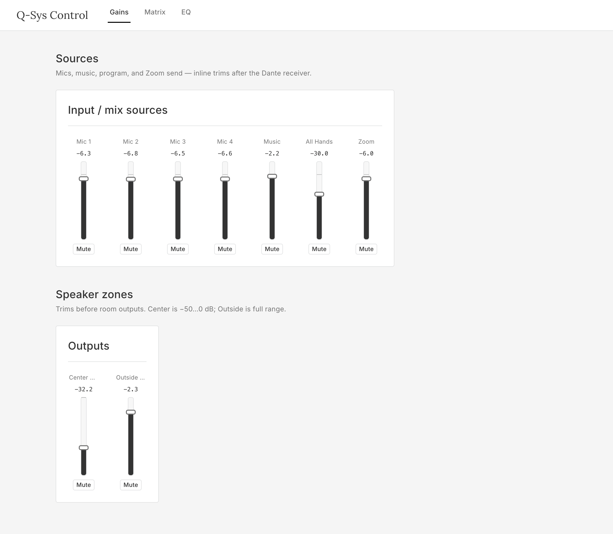
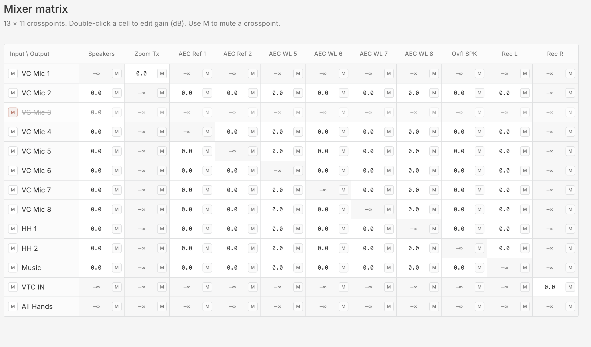
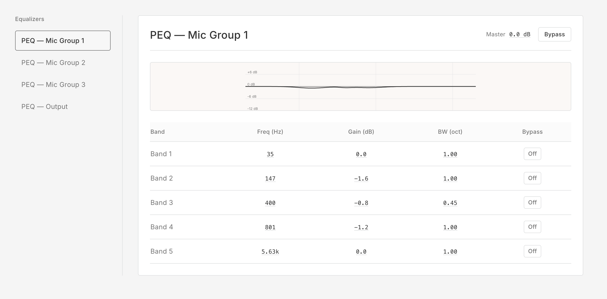

# Q-Sys MCP Server

An MCP (Model Context Protocol) server that connects Claude to live QSC Q-Sys Cores, enabling real-time control of audio parameters, routing, snapshots, and Lua scripting — directly from Claude.

## What it does

- **Live audio control** — adjust fader levels, mutes, EQ, dynamics, panning, matrix crosspoints on running designs
- **Multi-Core support** — connect to multiple Q-Sys Cores simultaneously (SFO, NYC, Toronto, etc.)
- **Snapshot management** — list, load, and save snapshots
- **Component inspection** — list components and read/write their controls
- **Lua execution** — run scripts on the Core
- **Dual protocol** — QRC (JSON-RPC, port 1710) primary with ECP (text, port 1702) fallback
- **Optional web UI** — local browser control for gains, matrix, and EQ with live updates from the Core (see [Web UI](#web-ui-local-browser-control))

## Web UI (local browser control)

The repository includes **Q-Sys Control**, a small app under `web/`:

- **Frontend:** React 18, Vite, TypeScript, Tailwind CSS — warm neutral palette, Inter + Lora typography, editorial layout (inspired by the Faire design language patterns: flat surfaces, 4px control radii, semantic status colors only).
- **Backend:** Express + `ws` — one persistent **WebSocket QRC (QRWC)** connection to the Core (`wss://<host>:443/qrc-public-api/v0`), **Change Group** polling, and fan-out to every connected browser.

Your browser only talks to `http://localhost` / `ws://localhost`, so you avoid self-signed certificate warnings and CORS issues that come from hitting the Core directly over `wss://`.

### Features

The UI is **not hardcoded to one design**. On each connection the backend calls `Component.GetComponents` / `Component.GetControls`, discovers:

- every **`gain`** component (single- or multi-channel — `gain` / `gain.N` + mutes),
- every **`mixer`** (matrix size and input/output labels come from the design),
- every **`equalizer_parametric`** (band count from `frequency.N` controls),

then registers those controls in a Change Group and sends a **`layout`** message to the browser before the first snapshot. Point `QSYS_HOST` at any Core with Script Access enabled and the tabs reflow to match.

| Tab | What it controls |
|-----|------------------|
| **Gains** | All discovered gain blocks — faders, dB readout, mute (and global bypass when present) |
| **Matrix** | One section per mixer component — crosspoint gain/mute, input row mute, labels from the Core |
| **EQ** | One sidebar entry per parametric EQ — band count and parameters match the block |

Other component types (Dante, plugins, UCI, etc.) are omitted on purpose to keep the Change Group size reasonable.

The backend loads a full control snapshot after discovery, polls periodically, and pushes **deltas** so the UI stays aligned when something else moves a control.

### Requirements (same as MCP tools)

Blocks you want to drive must have **Script Access → External** (or **All**) in Q-Sys Designer and the design pushed to the Core. Without that, the Change Group will not see those components.

### Quick start (production)

Compile the backend, build the frontend into `web/backend/dist/public`, then start the server (HTTP + browser WebSocket on one port):

```bash
cd web/backend && npm install && npm run build
cd ../frontend && npm install && npm run build
cd ../backend && npm start
```

Open **http://localhost:3001**. Environment variables (all optional):

| Variable | Default | Purpose |
|----------|---------|---------|
| `QSYS_HOST` | `10.4.18.1` | Core hostname or IP |
| `QSYS_WS_PORT` | `443` | QRWC (WebSocket QRC) port |
| `PORT` | `3001` | Local HTTP / WS port for the web UI |

Example:

```bash
QSYS_HOST=192.168.1.50 QSYS_WS_PORT=443 PORT=3001 npm start
```

(Run the last command from `web/backend` after `npm run build`, or use `QSYS_HOST=… ./web/start.sh` from the repo root — the script rebuilds the frontend and starts the backend; run `npm run build` in `web/backend` at least once so `dist/server.js` exists.)

### Development (Vite + hot reload)

```bash
QSYS_HOST=10.4.18.1 ./web/dev.sh
```

Then open **http://localhost:5173** — Vite proxies WebSocket traffic to the backend on port 3001.

### Screenshots

**Gains** — sources and speaker-zone trims after the Dante path:



**Matrix** — crosspoints, input mutes on the row, per-cell gain and mute:



**EQ** — pick a parametric EQ block, edit bands, optional bypass:



## Requirements

- Node.js 20+
- Q-Sys Designer 10.x Core(s) on the network
- [Claude Desktop](https://claude.ai/desktop) or any MCP-compatible host

## Q-Sys Designer setup

### Enabling component access (required for component tools)

The component tools (`qsys_list_components`, `qsys_get_component_controls`, `qsys_set_component_controls`) can only see and control blocks that have **Script Access** enabled in Q-Sys Designer.

**To expose components:**

1. Open your design in Q-Sys Designer
2. Select the blocks you want to control (use **Ctrl+A** to select all)
3. In the **Properties** panel, set **Script Access → External** (or **All**)
4. Save and push the design to the Core

Without this, `qsys_list_components` returns an empty list and component controls are invisible to Claude — even if the Core is reachable.

> **Tip:** Select all components at once and set Script Access in bulk. You only need to do this once per design push.

### Named Controls (optional — for `qsys_get_control` / `qsys_set_control`)

Named Controls are a separate mechanism in Q-Sys Designer's External Controls pane. They're **not required** if you use Script Access — component tools can reach any control on any exposed block. Named Controls are useful if you want short friendly aliases for specific controls, or for ECP-based integrations.

## Installation

```bash
npm install
npm run build
```

## Configuration

Add to your Claude Desktop `claude_desktop_config.json`:

```json
{
  "mcpServers": {
    "qsys": {
      "command": "node",
      "args": ["/path/to/q-sys-mcp/dist/index.js"],
      "env": {
        "QSYS_CORES": "sfo-allhands=10.1.1.100,nyc-display=10.2.1.100"
      }
    }
  }
}
```

### `QSYS_CORES` format

```
alias=host[:qrcPort[:ecpPort[:wsPort]]], ...
```

- Omit optional port segments to use defaults (TCP QRC: 1710, ECP: 1702)
- Providing a `wsPort` switches that Core to **WebSocket QRC (QRWC)** instead of TCP QRC

Examples:
```
# Single Core, TCP QRC (alias optional in tool calls)
QSYS_CORES=sfo=10.1.1.100

# Multiple Cores, TCP QRC
QSYS_CORES=sfo=10.1.1.100,nyc=10.2.1.100,toronto=10.3.1.100

# WebSocket QRC on port 443 (leave qrcPort and ecpPort empty)
QSYS_CORES=sfo=10.1.1.100:::443

# Custom TCP ports
QSYS_CORES=lab=192.168.1.50:1710:1702
```

### TCP QRC vs WebSocket QRC (QRWC)

| | TCP QRC | WebSocket QRC |
|---|---|---|
| Port | 1710 | 443 (default) |
| Protocol | JSON-RPC over TCP | JSON-RPC over `wss://` |
| `qsys_list_components` | All components | Script Access components only |
| `qsys_run_lua` | Yes | **Not supported** |
| Cert | n/a | Self-signed (accepted automatically) |

WebSocket mode requires **WebSocket capability enabled** in Core Manager under Network → Services.

## Available Tools

| Tool | Description |
|------|-------------|
| `qsys_list_cores` | List configured Cores and connection status |
| `qsys_core_status` | Get Core name, design, running state |
| `qsys_get_control` | Get a named control's value/position/string |
| `qsys_set_control` | Set a named control's value or position |
| `qsys_get_controls` | Batch-get multiple named controls |
| `qsys_list_components` | List all components in the running design |
| `qsys_get_component_controls` | Get all controls for a component |
| `qsys_set_component_controls` | Set one or more controls on a component |
| `qsys_list_snapshots` | List available snapshots |
| `qsys_load_snapshot` | Load/trigger a snapshot |
| `qsys_save_snapshot` | Save current state to a snapshot |
| `qsys_run_lua` | Execute Lua code on the Core |
| `qsys_create_change_group` | Create a change group for efficient polling |
| `qsys_poll_change_group` | Poll a change group for changed values |
| `qsys_destroy_change_group` | Clean up a change group |

> **Note:** Tools are being added incrementally. See [releases](../../releases) for current status.

## Example prompts

```
"Raise the main PA fader on sfo-allhands by 3dB"
"Mute all wireless mic channels on the NYC Core"
"Load the 'Pre-show' snapshot on sfo-allhands"
"What components are in the running design on the Toronto Core?"
"Set the EQ high-shelf on the lectern mic to +2dB at 10kHz"
```

## Architecture

```
Claude <-> MCP Server <-> ConnectionManager
                               |
                     +---------+-----------+
                     |                     |
              QrcClient / WsQrcClient   EcpClient
              (JSON-RPC, TCP 1710        (Text Protocol
               or wss:// port 443)        TCP 1702)
                     |                     |
                     +-----> Q-Sys Core(s)
```

- All connections are managed by `ConnectionManager` — tool code never opens sockets directly
- QRC is the primary protocol; ECP is used as fallback for simple get/set operations
- `WsQrcClient` is used when `wsPort` is set in `QSYS_CORES`; otherwise `QrcClient` (TCP) is used
- Connections are lazy: Cores connect on first tool call, not at server startup

## Development

```bash
npm run build    # compile TypeScript
npm run dev      # watch mode
node dist/index.js  # run server (stdio MCP)
```

## Security

`qsys_run_lua` executes arbitrary Lua on the Core. Treat network access as the trust boundary — only expose this server to trusted MCP clients.

> **Note:** `qsys_run_lua` is only available over TCP QRC (port 1710). It is not supported by the WebSocket QRC endpoint.
