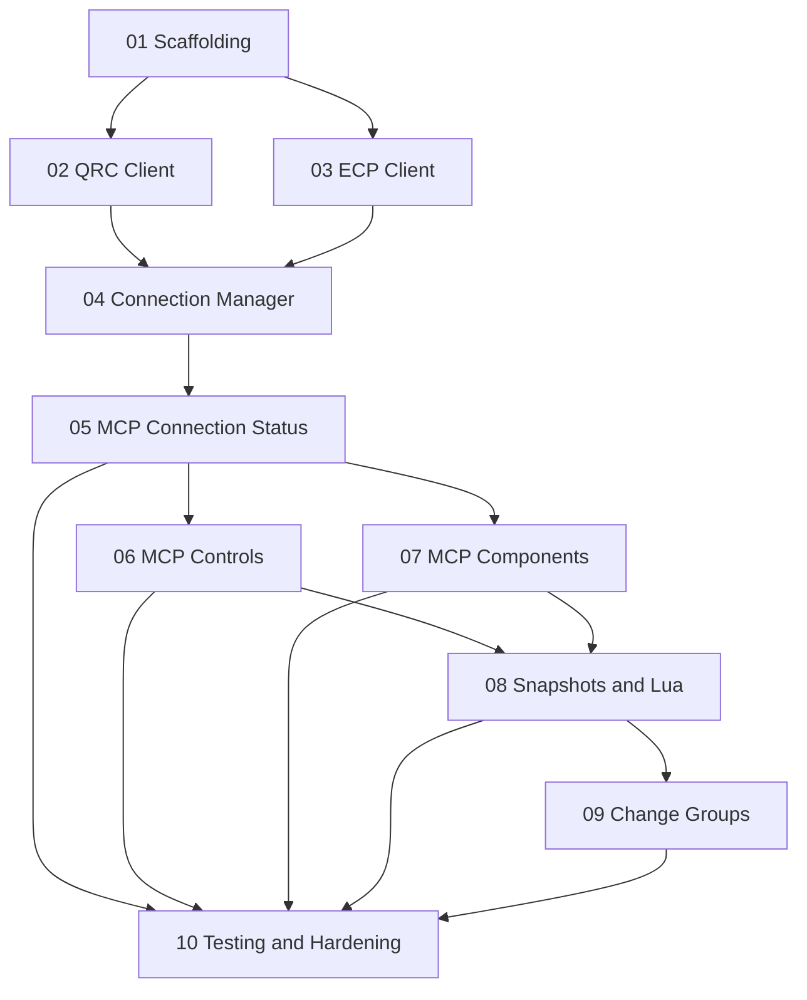

# Q-Sys MCP — Parallel Work Index

> **Purpose:** Split the master design in `plan.md` into parallelizable tracks. Each track has its own plan file and a **recommended Anthropic model** for Claude Code sessions working that track (token efficiency vs. reasoning depth).

**Master architecture reference:** [`../../plan.md`](../../plan.md)

---

## Dependency graph

---

## Parallel waves

| Wave | Plans | Can run in parallel | Notes |
|------|--------|---------------------|--------|
| **0** | [01-scaffolding.md](./01-scaffolding.md) | No (gate) | Everything else assumes this repo layout and deps. |
| **1** | [02-qrc-client.md](./02-qrc-client.md), [03-ecp-client.md](./03-ecp-client.md) | **Yes** | Agree on `src/types.ts` contracts in 01 first; avoid cross-imports until 04. |
| **2** | [04-connection-manager.md](./04-connection-manager.md) | No | Needs stable QRC + ECP client surfaces. |
| **3** | [05-mcp-connection-status.md](./05-mcp-connection-status.md) | Prefer **first** in this wave | Smoke-test MCP + live StatusGet before heavy tools. |
| **3b** | [06-mcp-controls.md](./06-mcp-controls.md), [07-mcp-components.md](./07-mcp-components.md) | **Yes** *after* 05 | Coordinate on shared tool registration patterns in `src/index.ts`. |
| **4** | [08-mcp-snapshots-lua.md](./08-mcp-snapshots-lua.md) | Mostly sequential after 06/07 | Uses QRC heavily; merge conflicts possible—short sessions or one owner. |
| **5** | [09-mcp-change-groups.md](./09-mcp-change-groups.md) | Can parallel **4** if files are separate | Prefer after 06/07 so patterns exist. |
| **6** | [10-testing-hardening.md](./10-testing-hardening.md) | No (capstone) | Runs last; covers integration and edge cases. |

---

## Model recommendation key

Use these **Claude Code model aliases** (see [model configuration](https://docs.anthropic.com/en/docs/claude-code/model-config)):

| Alias | Use when |
|--------|-----------|
| `haiku` | Repetitive structure, thin wrappers, straightforward parsing, scaffolding boilerplate. |
| `sonnet` | Default for protocol logic, MCP tool design, integration, and debugging. |
| `opus` | Ambiguous specs, security review (e.g. Lua exposure), or gnarly concurrency/edge cases. |

**Per-track defaults:**

| Plan file | Recommended model | Rationale |
|-----------|-------------------|-----------|
| [01-scaffolding.md](./01-scaffolding.md) | `haiku` | npm/tsconfig/MCP skeleton; low risk. |
| [02-qrc-client.md](./02-qrc-client.md) | `sonnet` | JSON-RPC framing, async ids, edge cases. |
| [03-ecp-client.md](./03-ecp-client.md) | `haiku` | Line-based protocol; smaller surface. |
| [04-connection-manager.md](./04-connection-manager.md) | `sonnet` | Lifecycle, backoff, multi-core correctness. |
| [05-mcp-connection-status.md](./05-mcp-connection-status.md) | `haiku` | Thin tools once clients exist. |
| [06-mcp-controls.md](./06-mcp-controls.md) | `sonnet` | QRC/ECP fallback behavior. |
| [07-mcp-components.md](./07-mcp-components.md) | `sonnet` | Bulk controls; main operational API. |
| [08-mcp-snapshots-lua.md](./08-mcp-snapshots-lua.md) | `sonnet` (Lua review: consider `opus`) | Snapshots + privileged Lua execution. |
| [09-mcp-change-groups.md](./09-mcp-change-groups.md) | `haiku` | Straight QRC pass-through. |
| [10-testing-hardening.md](./10-testing-hardening.md) | `sonnet` | Integration debugging; use `opus` if failures are opaque. |

---

## Open questions (from `plan.md`) — ownership

Resolve during **04** (lazy vs eager, health checks) and **06** (ECP fallback visibility); **08** (snapshot naming modes); **08** + security pass (Lua guardrails).

---

## Execution handoff

Pick one plan file, start Claude Code with `/model <alias>` as in the table, and work that file’s checklist. For Wave 1, assign **two sessions**: one on 02, one on 03, with shared types merged via 01.
